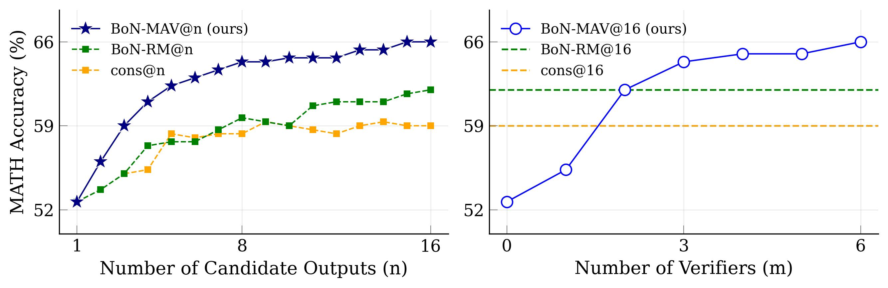
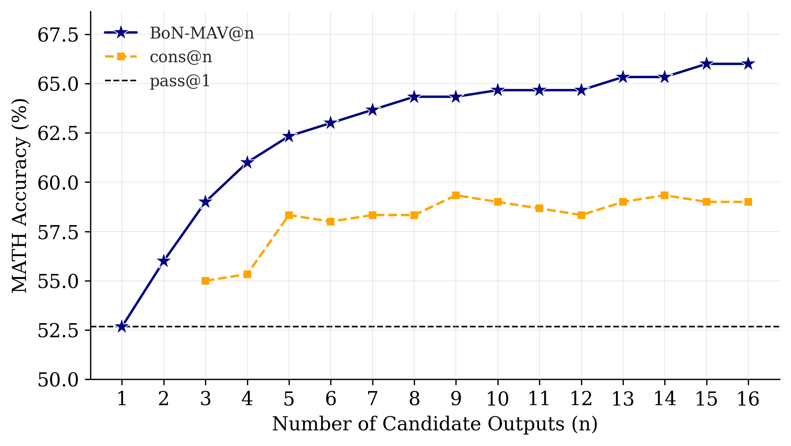
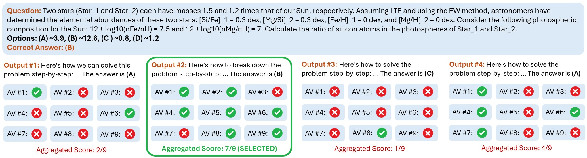

# Multi-Agent Verification: Scaling Test-Time Compute with Multiple Verifiers

Shalev Lifshitz, Sheila A. McIlraith, Yilun Du

[Project Page](https://ardalabs.ai/MultiAgentVerification) | [ArXiv](https://arxiv.org/abs/2502.20379) | [PDF](https://arxiv.org/pdf/2502.20379)

<br>



## Abstract

By utilizing more computational resources at test-time, large language models (LLMs) can improve without additional training. One common strategy uses *verifiers* to evaluate candidate outputs. In this work, we propose a novel scaling dimension for test-time compute: *scaling the number of verifiers*. We introduce Multi-Agent Verification (MAV) as a test-time compute paradigm that combines multiple verifiers to improve performance. We propose using Aspect Verifiers (AVs), off-the-shelf LLMs prompted to verify different aspects of outputs, as one possible choice for the verifiers in a MAV system. AVs are a convenient building block for MAV since they can be easily combined without additional training. Moreover, we introduce BoN-MAV, a simple multi-agent verification algorithm that combines best-of-*n* sampling with multiple verifiers. BoN-MAV demonstrates stronger scaling patterns than self-consistency and reward model verification, and we demonstrate both weak-to-strong generalization, where combining weak verifiers improves even stronger LLMs, and self-improvement, where the same base model is used to both generate and verify outputs. Our results establish scaling the number of verifiers as a promising new dimension for improving language model performance at test-time.

## Directory Structure

```
.
├── README.md
├── runs
│   ├── example_math_gemini-1.5-flash.zip
├── src
│   ├── main.py
│   ├── dataset_files
│       ├── All files for loading questions from datasets.
│   ├── prompts
│       ├── The prompts for the generator LLMs and each aspect verifier.
│   ├── utils
│       ├── Various helper functions.
│   ├── example_data
│       ├── gemini-1.5-flash_MATH.json
```

# Try Multi-Agent Verification

## Setup

We recommend using a conda environment with Python 3.10.

1. Install requirements: `pip install -r requirements.txt` 
2. Install 'mav' locally with: `pip install -e .`

## Run the code

First, make sure to write the path to your project 

### Using Example Data (No API Calls)

The repository includes an example file `example_math_gemini-1.5-flash.zip` in `runs/` containing pre-generated BoN-MAV data for 300 questions from MATH using Gemini-1.5-Flash as the generator LLM. For each question, this contains 16 candidate solutions and their binary approvals from the domain-specific aspect verifiers for MATH.

To evaluate this pre-generated data without making any API calls, you must first unzip the example data with `unzip runs/example_math_gemini-1.5-flash.zip runs/` so that the final file structure is `runs/example_math_gemini-1.5-flash/solutions/...` (the `solutions` contains one JSON file per question). Then run:
```bash
python src/main.py --use-example-data --self-cons --bon-mav
```

Where:
- `--use-example-data` specifies to use the pre-generated example data rather than generating new data via API calls
- `--self-cons` is an evaluation flag to include self-consistency results in the output plots/metrics
- `--bon-mav` is an evaluation flag to include BoN-MAV results in the output plots/metrics

The resulting plot will be saved in the run directory `runs/example_math_gemini-1.5-flash/solution_scaling_plot.png` and will include `self-cons` and `bon-mav` according to the flags specified. The plot should look like:



### Generating New Data with API Calls

**WARNING: This will make API calls to language models and can be expensive for large amounts of data!**

To generate new data by querying APIs, first ensure you have set up your API keys:
- `OPENAI_API_KEY` environment variable for OpenAI models
- `GEMINI_API_KEY` environment variable for Gemini models

Then run the following command to re-generate the example data and evaluate `bon-mav` and `self-cons`:

```bash
python src/main.py --self-cons --bon-mav --dataset math --gen-model gemini-1.5-flash-001 --n-problems 300 --n-solutions 16
```

Parameters you can configure:
- `--dataset`: The dataset to use (one of: "math", "mmlu-pro", "gpqa-diamond", "humaneval")
- `--gen-model`: The generator model (default: "gemini-1.5-flash-001")
  - The code is set up to accept any model from the OpenAI API starting with "gpt" and any model from the Gemini API starting with "gemini". To add more models, modify `utils/gen_utils.py`, `utils/vera_utils.py`, and `utils/api_utils.py`.
- `--n-problems`: Number of problems to evaluate (default: 300)
- `--n-solutions`: Number of candidate solutions per problem (default: 16)
- `--seed`: Random seed (default: 42)
- `--gen-temp`: Generator temperature (default: 0.7)
- `--vera-temp`: Verifier temperature (default: 0.0)

For HumanEval, run:

```bash
cd src/dataset_files/simple_evals/
git clone https://github.com/openai/human-eval
touch human-eval/__init__.py
pip install -e human-eval
mv human-eval human_eval_files  # since we cannot have dashes in module names
cd ../../..
pip install -e .
```

### Advanced Configuration

The code is set up to load domain-specific verifiers for each dataset using `load_domain_specific_verifiers()` in `src/main.py`. You can override this function to load your own combination of verifiers, and create new verifiers by adding to the `vera_names_to_prompts` dictionary in `src/prompts/vera_prompts.py`.

While this repository does not include code for reward model verification, you can add this functionality by modifying the `evaluate` function in `src/main.py` to use a reward model for selecting between candidate outputs.

**Note**: To use the MATH dataset, you must download the MATH.tar file from the official MATH repository (https://github.com/hendrycks/math), extract the tar file, and set `MATH_DATASET_DIRPATH_TST` in `src/main.py` to the path of the test set.

# BoN-MAV Illustration


*BoN-MAV is one simple implementation of a multi-agent verification algorithm. Multiple aspect verifiers checking different aspects of solutions are used to evaluate candidate outputs and the solution with the most approvals is selected.*

# BibTeX

Please cite our paper if you find Multi-Agent Verification useful for your research:
```
@article{lifshitz2025multiagent,
  title={Multi-Agent Verification: Scaling Test-Time Compute with Multiple Verifiers},
  author={Lifshitz, Shalev and McIlraith, Sheila A. and Du, Yilun},
  journal={arXiv preprint arXiv:2502.20379},
  year={2025},
  url={https://arxiv.org/abs/2502.20379}
}
```